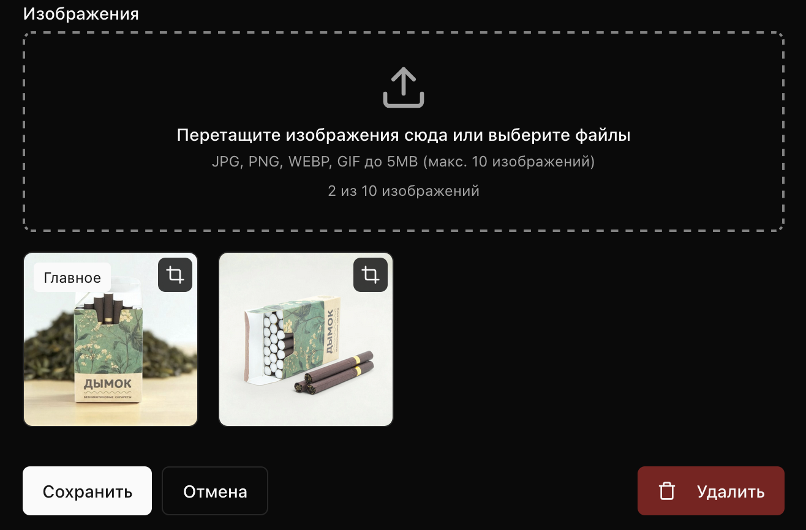

# shadcn Image Upload Form Template

A complete, reusable image upload form component with crop, preview, reorder and cover selection functionality. Built with **Next.js 15**, **React 19**, **shadcn/ui** and **react-easy-crop**.



## Features

- **Drag & Drop Upload** - Drag files directly onto the drop zone
- **Multiple File Selection** - Select multiple images at once
- **File Validation** - Validates file type (JPG, PNG, WEBP, GIF) and size (max 5MB)
- **Image Cropping** - Crop images with custom aspect ratio using react-easy-crop
- **Aspect Ratio Preview** - Preview how image will look with specified aspect ratio
- **Cover Image Selection** - First image is marked as cover, click star to change
- **Drag to Reorder** - Drag images to reorder them
- **Dark Mode Support** - Works with both light and dark themes

## Requirements

- **Node.js** >= 22.0.0
- **npm** >= 10.0.0 or **pnpm** >= 8.0.0

## Dependencies

### Core Dependencies

| Package | Version | Description |
|---------|---------|-------------|
| `next` | ^15.1.0 | React framework |
| `react` | ^19.0.0 | UI library |
| `react-dom` | ^19.0.0 | React DOM |
| `react-easy-crop` | ^5.5.0 | Image cropping component |

### UI Components (shadcn/ui)

| Package | Version | Description |
|---------|---------|-------------|
| `@radix-ui/react-dialog` | ^1.1.15 | Dialog/Modal primitives |
| `@radix-ui/react-label` | ^2.1.8 | Label primitives |
| `@radix-ui/react-slider` | ^1.3.6 | Slider primitives |
| `@radix-ui/react-slot` | ^1.2.4 | Slot primitives |
| `@radix-ui/react-toast` | ^1.2.15 | Toast notifications |

### Styling

| Package | Version | Description |
|---------|---------|-------------|
| `tailwindcss` | ^3.4.16 | CSS framework |
| `tailwindcss-animate` | ^1.0.7 | Animation utilities |
| `class-variance-authority` | ^0.7.1 | Component variants |
| `clsx` | ^2.1.1 | Class name utility |
| `tailwind-merge` | ^2.6.0 | Merge Tailwind classes |
| `lucide-react` | ^0.454.0 | Icons |

### Dev Dependencies

| Package | Version | Description |
|---------|---------|-------------|
| `typescript` | ^5.7.2 | TypeScript |
| `@types/node` | ^22 | Node.js types |
| `@types/react` | ^19 | React types |
| `@types/react-dom` | ^19 | React DOM types |
| `autoprefixer` | ^10.4.20 | PostCSS plugin |
| `postcss` | ^8.4.49 | CSS processor |

## Installation

```bash
# Clone the repository
git clone git@github.com:xfce0/shadcn-image-form.git
cd shadcn-image-form

# Install dependencies
npm install
# or
pnpm install

# Run development server
npm run dev
# or
pnpm dev
```

Open [http://localhost:3000](http://localhost:3000) to see the demo.

## Project Structure

```
shadcn-image-form/
├── src/
│   ├── app/
│   │   ├── globals.css          # Global styles with CSS variables
│   │   ├── layout.tsx           # Root layout with Toaster
│   │   └── page.tsx             # Demo page
│   ├── components/
│   │   ├── image-form/          # Main components
│   │   │   ├── index.ts         # Exports
│   │   │   ├── image-upload.tsx # Main upload component
│   │   │   ├── image-crop-dialog.tsx   # Crop dialog
│   │   │   └── image-preview-dialog.tsx # Preview dialog
│   │   └── ui/                  # shadcn/ui components
│   │       ├── button.tsx
│   │       ├── card.tsx
│   │       ├── dialog.tsx
│   │       ├── label.tsx
│   │       ├── slider.tsx
│   │       ├── toast.tsx
│   │       └── toaster.tsx
│   ├── hooks/
│   │   └── use-toast.ts         # Toast hook
│   └── lib/
│       └── utils.ts             # Utility functions (cn)
├── public/
│   └── examples/
│       └── example-screenshot.png
├── package.json
├── tailwind.config.ts
├── tsconfig.json
└── next.config.ts
```

## Usage

### Basic Usage

```tsx
"use client";

import { useState } from "react";
import { ImageUpload, type ImageItem } from "@/components/image-form";

export default function MyForm() {
  const [images, setImages] = useState<ImageItem[]>([]);

  return (
    <ImageUpload
      images={images}
      onChange={setImages}
      maxImages={10}
    />
  );
}
```

### With All Features

```tsx
<ImageUpload
  images={images}
  onChange={setImages}
  maxImages={10}
  enableCrop              // Enable crop button
  enablePreview           // Enable preview button
  enableReorder           // Enable drag to reorder
  showCoverBadge          // Show "Cover" badge on first image
  coverBadgeLabel="Cover" // Custom cover badge text
  aspectRatio={4 / 3}     // Aspect ratio for crop/preview
  allowedTypes={["image/jpeg", "image/png", "image/webp", "image/gif"]}
  maxFileSize={5 * 1024 * 1024} // 5MB
/>
```

### With Custom Upload Handler

```tsx
<ImageUpload
  images={images}
  onChange={setImages}
  onUpload={async (file) => {
    // Upload to your server
    const formData = new FormData();
    formData.append("file", file);

    const response = await fetch("/api/upload", {
      method: "POST",
      body: formData,
    });

    const data = await response.json();
    return data.url; // Return the uploaded image URL
  }}
  onCropComplete={async (imageId, croppedBlob) => {
    // Upload cropped image to server
    const formData = new FormData();
    formData.append("file", croppedBlob, "cropped.jpg");

    const response = await fetch("/api/upload", {
      method: "POST",
      body: formData,
    });

    const data = await response.json();
    return data.url;
  }}
/>
```

## Component API

### ImageUpload Props

| Prop | Type | Default | Description |
|------|------|---------|-------------|
| `images` | `ImageItem[]` | required | Array of image items |
| `onChange` | `(images: ImageItem[]) => void` | required | Callback when images change |
| `maxImages` | `number` | 10 | Maximum number of images |
| `allowedTypes` | `string[]` | `["image/jpeg", "image/png", "image/webp", "image/gif"]` | Allowed MIME types |
| `maxFileSize` | `number` | 5MB | Maximum file size in bytes |
| `aspectRatio` | `number` | 4/3 | Aspect ratio for crop/preview |
| `enableCrop` | `boolean` | true | Enable crop functionality |
| `enablePreview` | `boolean` | true | Enable preview functionality |
| `enableReorder` | `boolean` | true | Enable drag to reorder |
| `showCoverBadge` | `boolean` | true | Show cover badge on first image |
| `coverBadgeLabel` | `string` | "Cover" | Text for cover badge |
| `onUpload` | `(file: File) => Promise<string>` | - | Custom upload handler |
| `onCropComplete` | `(imageId: string, blob: Blob) => Promise<string>` | - | Custom crop upload handler |
| `gridCols` | `object` | `{default: 2, sm: 3, md: 4}` | Grid columns config |

### ImageItem Type

```typescript
interface ImageItem {
  id: string;      // Unique identifier
  url: string;     // Image URL (data URL, blob URL, or remote URL)
  file?: File;     // Original file (if uploaded locally)
}
```

### ImageCropDialog Props

| Prop | Type | Default | Description |
|------|------|---------|-------------|
| `imageUrl` | `string` | required | URL of image to crop |
| `imageName` | `string` | - | Optional name for file |
| `aspectRatio` | `number` | 4/3 | Crop aspect ratio |
| `onCropComplete` | `(image: Blob \| string) => void` | required | Callback with cropped image |
| `returnDataUrl` | `boolean` | false | Return Data URL instead of Blob |
| `title` | `string` | "Crop Image" | Dialog title |
| `description` | `string` | - | Dialog description |

### ImagePreviewDialog Props

| Prop | Type | Default | Description |
|------|------|---------|-------------|
| `imageUrl` | `string` | required | URL of image to preview |
| `imageName` | `string` | - | Optional name |
| `aspectRatio` | `number` | 4/3 | Aspect ratio for comparison |

## How It Works

### Image Upload Flow

1. User drops/selects files
2. Files are validated (type, size, count)
3. Valid files are converted to Data URLs (or uploaded via `onUpload`)
4. Images added to state with unique IDs

### Image Cropping Flow

1. User clicks crop button on image
2. Dialog opens with react-easy-crop component
3. User adjusts crop area and zoom
4. On save:
   - Crop coordinates captured
   - Canvas used to extract cropped area
   - Result converted to JPEG blob
   - If `onCropComplete` provided, blob uploaded to server
   - Otherwise, blob converted to Data URL
5. Image URL in state updated with cropped version

### Cover Selection Flow

1. First image in array is always the cover
2. User can click star button on any non-cover image
3. That image moves to first position in array
4. Cover badge updates automatically

### Reorder Flow

1. User drags an image card
2. Drop position tracked with drag-over events
3. On drop, images array reordered
4. State updated with new order

## Customization

### Change Aspect Ratio

```tsx
<ImageUpload
  aspectRatio={16 / 9}  // 16:9 for video thumbnails
  // or
  aspectRatio={1}       // 1:1 for avatars
/>
```

### Custom Grid Layout

```tsx
<ImageUpload
  gridCols={{
    default: 2,  // 2 columns on mobile
    sm: 3,       // 3 columns on small screens
    md: 4,       // 4 columns on medium screens
    lg: 5,       // 5 columns on large screens
  }}
/>
```

### Disable Features

```tsx
<ImageUpload
  enableCrop={false}      // No crop button
  enablePreview={false}   // No preview button
  enableReorder={false}   // No drag to reorder
  showCoverBadge={false}  // No cover badge
/>
```

## License

MIT
